# vue_router
> vue的router学习练习

## 基本使用

1. 创建路由器
2. 应用到根组件上
3. 定义路由组件

### 创建路由器

> 在main.js中新建临时路由器（对象思维）

```js
import './style.css'
import { createApp } from 'vue'
import App from './App.vue'
import { createMemoryHistory, createRouter, createWebHistory } from 'vue-router'
import Home from './views/Home.vue'
import ChickenEgg from './views/ChickenEgg.vue'

const router = createRouter(
  {
    history:createWebHistory(),
    routes: [
      { path: '/', component: Home },
      { path: '/chicken-egg', component: ChickenEgg },
    ]
    // 创建路由:注意创建路由还是不行，需要创建历史模式
  }
)


const app = createApp(App)

app.use(router)

app.mount('#app')
// ceateApp(App).use(router).mount('#app')
// 一键创建实例并且挂载
```

### 应用到根组件上

```vue
<script setup>
import { RouterLink, RouterView } from 'vue-router'
</script>

<template>
  <div>
    <RouterLink to="/"></RouterLink>
    <RouterLink to="/chicken-egg"></RouterLink>
    <!-- 里面能填些内容，表现就像nav标签一样了 -->
    <RouterView />
  </div>
</template>

```

### 定义路由组件

Home组件和ChickenEgg组件就不看了，随便填填能够实现路由逻辑了。	


简单展示下即可。

## a || router-link

### a标签

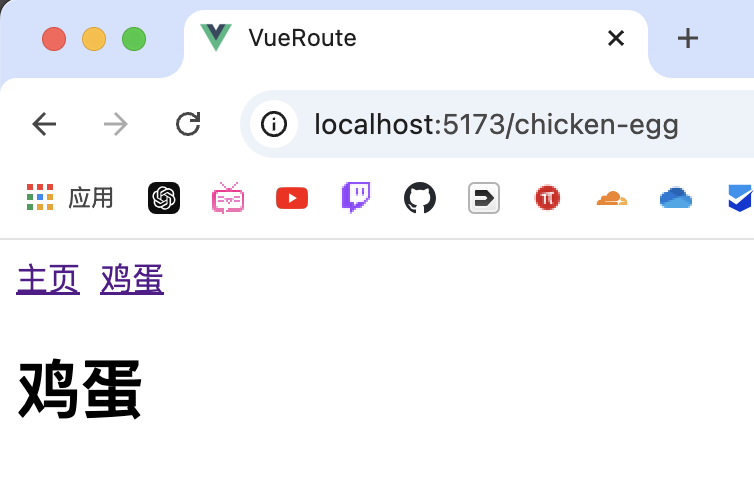


```vue
<script setup>
import { RouterLink, RouterView } from 'vue-router'
</script>

<template>
  <nav>
    <a href="/">a首页</a> |
    <a href="/chicken-egg">a鸡蛋</a> |
    <RouterLink to="/">首页</RouterLink> |
    <RouterLink to="/chicken-egg">鸡蛋</RouterLink> |
  </nav>
  <RouterView />
</template>

<style scoped>

</style>  
```


问题是a标签在点击的时候会造成浏览器刷新。

### router-link标签 

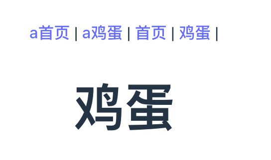

显示效果几乎一致，样式也是按照a标签的样式排版的。

按f12调试知道router-link标签不会造成页面的刷新显示。

## router文件夹

创建router文件夹，里面创建index.js

```js
import { createMemoryHistory, createRouter, createWebHistory } from 'vue-router'
import Home from '../views/Home.vue'
import ChickenEgg from '../views/ChickenEgg.vue'

const router = createRouter(
  {
    history: createWebHistory(),
    routes: [
      { path: '/', component: Home },
      { path: '/chicken-egg', component: ChickenEgg },
    ]
    // 创建路由:注意创建路由还是不行，需要创建历史模式
  }
)
export default router
// 注意导出对象让其他组件能够使用
```

> 注意末尾这里一定要导出组件

vue有响应式api和分布式，js？  准确来说vue也是js文件呢，vue.js

从面对对象的角度来说导出就显得非常合理了。有点类似于statis对象/方法能让其他对象随便使用。

得到的简洁的main.js如下：

> 注意 main.js 是看全局的，整体观

main.js

```js
import { createApp } from 'vue'
import App from './App.vue'
import router from './router'

const app = createApp(App)

app.use(router)

app.mount('#app')
```

## data.json

修改app.vue如下：

### App.vue

```vue
<script setup>
import { RouterLink, RouterView } from 'vue-router'
import dataEggs from './data.json'
</script>

<template>
  <nav>
    <RouterLink to="/">首页</RouterLink> |
    <RouterLink v-for="dataEgg in dataEggs" :key="dataEgg.id" :to="`/egg/${dataEgg.type}`">
      {{ dataEgg.name }} |
    </RouterLink>
    <!-- 这里删掉了chicken-egg组件路由，添加了一个遍临json的路由，json数据见补充部分 -->
  </nav>
  <RouterView />
</template>

<style scoped></style>
```

### Eggs.vue

```vue
<script setup>
    
</script>
  
<template>
    <h1>蛋-路由组件</h1>
    <!-- 那几个路径匹配都是这个组件 -->
     {{ $route }}
</template>
  
<style scoped>
    
</style>
```

效果如下：
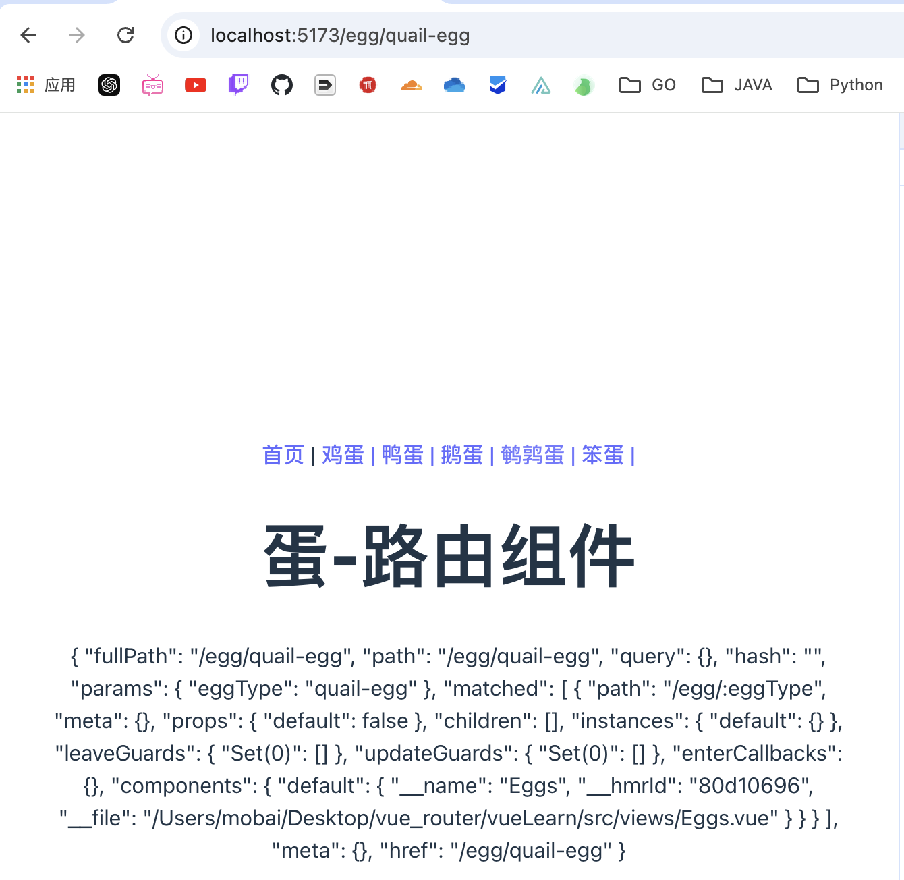

### {{$route}}

修改Eggs.vue代码如下：

```vue
<script setup>
    
</script>
  
<template>
    <h1>蛋-路由组件</h1>
    <!-- 那几个路径匹配都是这个组件 -->
     {{ $route }}
</template>
  
<style scoped>
    
</style>
```

> 仅添$route的结果如下：

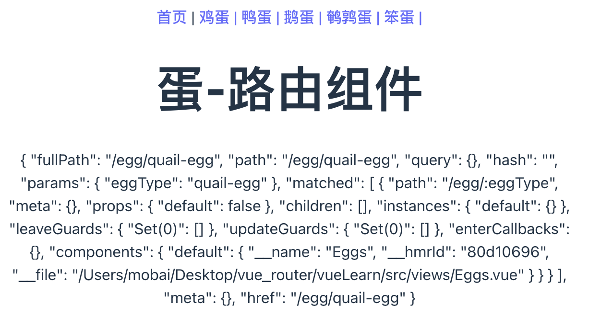

展示详细的路由信息。根据这些信息获取到json文件中的全部数据然后显示出来。

### 控制台打印

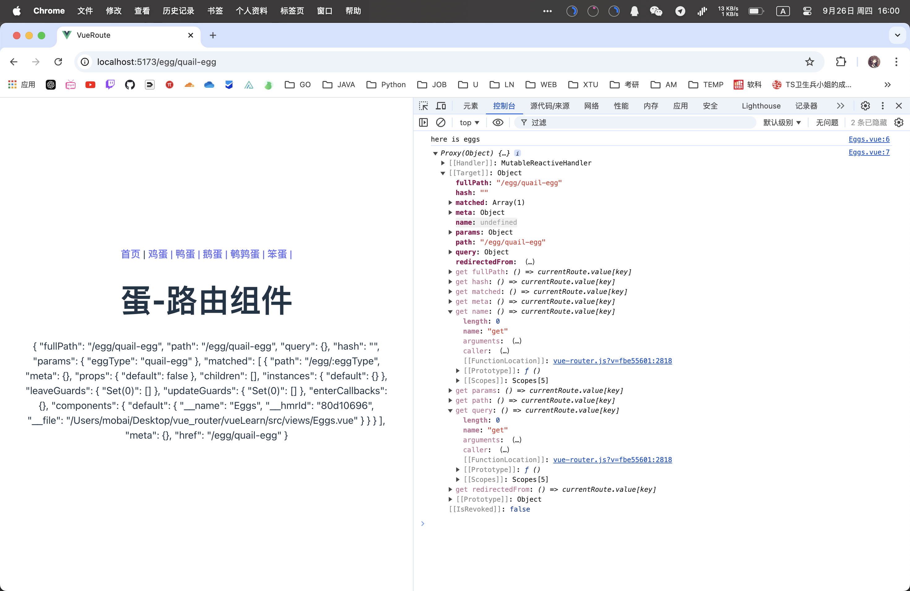

代码如下：

### Eggs.vue

```vue
<script setup>
import { useRoute } from 'vue-router';

const route = useRoute();
// 使用useRoute获取路由
console.log("here is eggs");
console.log(route);
</script>

<template>
  <h1>蛋-路由组件</h1>
  <!-- 那几个路径匹配都是这个组件 -->
  {{ $route }}
</template>

<style scoped></style>
```

path是：path: "/egg/:eggType“

就是之前定义的eggType动态路由，但是其展开值是比如：quail-egg

能够利用唯一的eggType值对json中的数据进行定位，但是使用id的值也是可以的。

### 路径 -> 信息

Eggs.vue

```vue
<script setup>
import { computed } from 'vue';
import { useRoute } from 'vue-router';
import dataEggs from '../data.json';

const route = useRoute();
// 获取路径
const eggType = computed(() => route.params.eggType);
// 根据路径获取eggType
const dataEgg = computed(() => dataEggs.find(dataEgg => dataEgg.type === eggType.value));
// 计算属性获取到想要的数据到dataEgg中
</script>

<template>
  {{ dataEgg }}

</template>

<style scoped></style>
<!-- 
dataEgg => dataEgg.type === eggType.value
这个是find的回调函数，在dataEggs中遍历，每个遍历元也叫dataEgg，当type等于eggType.value时，返回这个dataEgg
() => 箭头函数，没有参数， => 后面就是返回值
-->
```

> 根据路由获取具体需要的值然后获取到想要的信息。

展示结果如下：
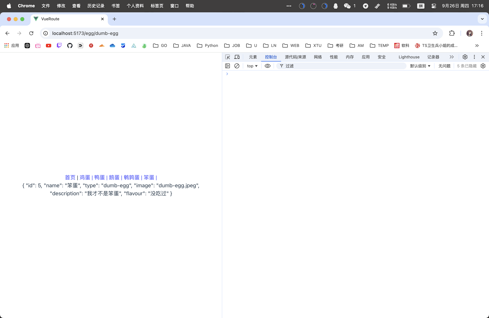

## 信息深度处理

修改Eggs.vue

### Eggs.vue

```vue
<script setup>
import { computed } from 'vue';
import { useRoute } from 'vue-router';
import dataEggs from '../data.json';

const route = useRoute();
const eggType = computed(() => route.params.eggType);
const dataEgg = computed(() => dataEggs.find(dataEgg => dataEgg.type === eggType.value));
</script>

<template>
  <h1>{{ dataEgg.name }}</h1>
  <p>{{ dataEgg.description }}</p>
  <p>{{ dataEgg.flavour }}</p>
  
</template>

<style scoped>
  img{
    width: 150px;
    height: 150px;
  }
</style>
```

结果如下：

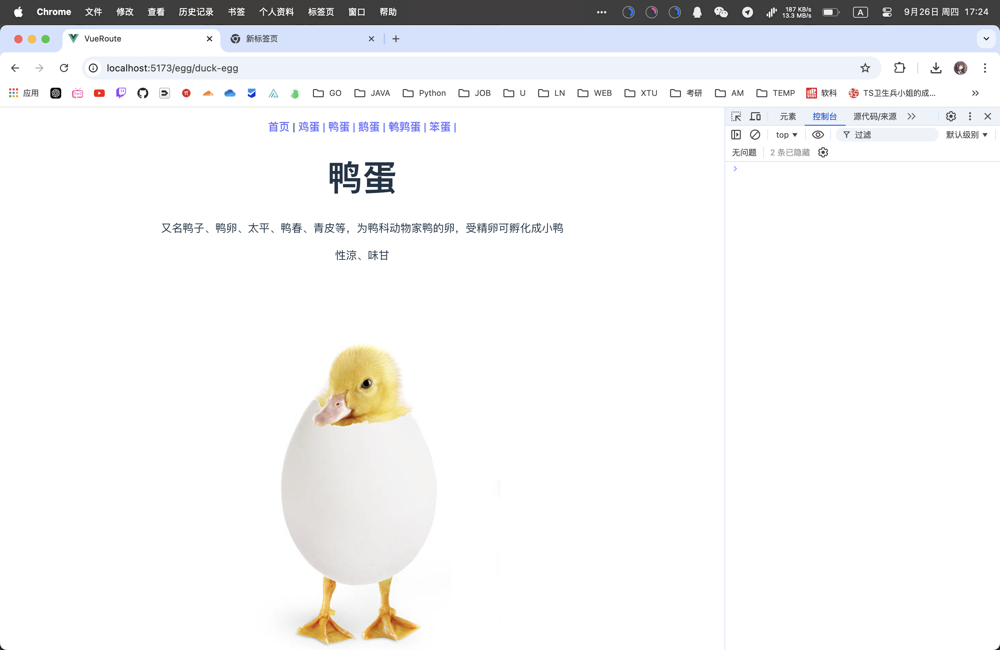


### 活动类

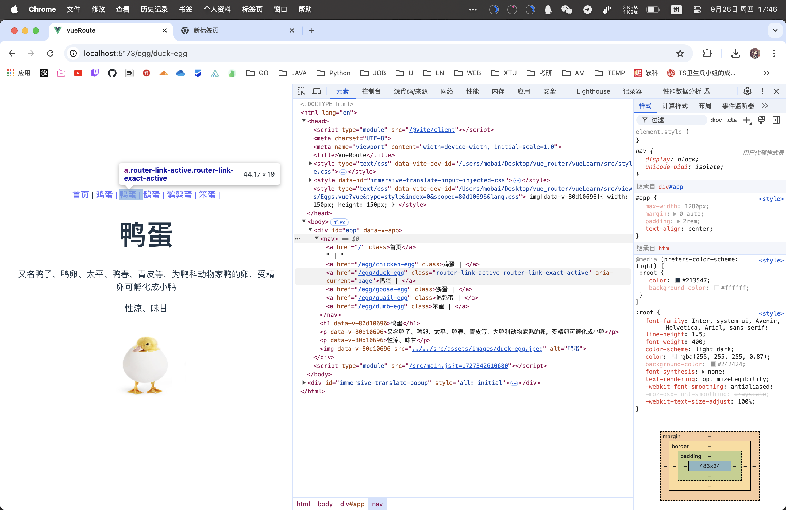

注意每次点击标签的时候看到右边部分数据和路径的变化。

尤其关注 ”router-link-exact-active“ 这个tag

### App.vue

只截取后面部分的style

```vue
<style scoped>
  .router-link-active {
    color:red;
  }
</style>
```

### index.js

只截取定义

```js
const router = createRouter(
  {
    history: createWebHistory(),
    routes: [
      { path: '/', component: Home },
      { path: '/egg/:eggType', component: Eggs },
    ],
    linkActiveClass:'egg-active'
    // 自定义活动tag
  }
)
```

结果如下：
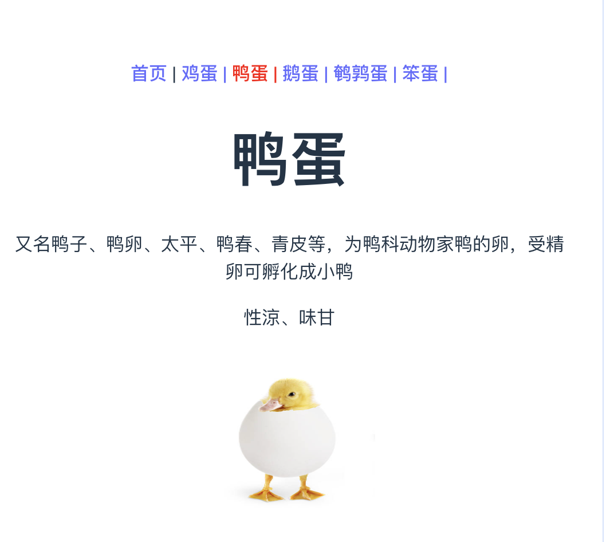

可见活动标签页变为啦红色。

## 关于router

### 整理router

index.js

```js
import { createMemoryHistory, createRouter, createWebHistory } from 'vue-router'
import Home from '../views/Home.vue'
import Eggs from '../views/Eggs.vue'

const routes = [
  { path: '/', component: Home },
  { path: '/egg/:eggType', component: Eggs }
];
// 将路由数组移动出来

const router = createRouter(
  {
    history: createWebHistory(),
    routes,
    linkActiveClass: 'egg-active'
  }
)
export default router
```

## 关于网页结构

`createWebHistory` 是 Vue Router 中用于创建 HTML5 历史模式的函数。它利用浏览器的 `history.pushState`和 `history.replaceState`方法来管理路由，而不是使用 URL 哈希（`#`）来表示不同的路由。

在 Vue Router 中，有三种主要的路由模式：

1. **`createWebHistory`**（HTML5 历史模式）：
   - 使用浏览器的历史 API (`pushState` 和 `replaceState`)。
   - URL 看起来像正常的路径（例如 `/home`）。
   - 需要服务器配置支持，因为直接访问子路径时，服务器需要返回应用的 `index.html` 文件。
2. **`createWebHashHistory`**（哈希模式）：
   - 使用 URL 哈希（`#`）来模拟完整的 URL。
   - URL 包含 `#`符号（例如 `/#/home`）。
   - 不需要服务器配置支持，因为哈希部分不会被发送到服务器。
3. **`createMemoryHistory`**（内存模式）：
   - 将路由状态保存在内存中。
   - 通常用于服务器端渲染（SSR）或测试环境。
   - URL 不会改变，因为它不依赖于浏览器的地址栏。

### 区别

- **URL 结构**：
  - `createWebHistory`：URL 看起来像正常路径（例如 `/home`）。
  - `createWebHashHistory`：URL 包含 `#`符号（例如 `/#/home`）。
  - `createMemoryHistory`：URL 不会改变。
- **服务器配置**：
  - `createWebHistory`：需要服务器配置支持，确保所有路由都指向应用的 `index.html`。
  - `createWebHashHistory`：不需要服务器配置支持。
  - `createMemoryHistory`：不需要服务器配置支持。
- **使用场景**：
  - `createWebHistory`：适用于需要干净 URL 的单页应用（SPA）。
  - `createWebHashHistory`：适用于不需要服务器配置支持的应用。
  - `createMemoryHistory`：适用于服务器端渲染（SSR）或测试环境。

### createWebHistory

> 这里就不展示了，注意看下面的路径添加了一个#号以及后面的路径需要明确。

### createWebHashHistory

```js
{
    history: createWebHashHistory(),  // 注意这里提前导入包
    routes,
    linkActiveClass: 'egg-active'
  }
```

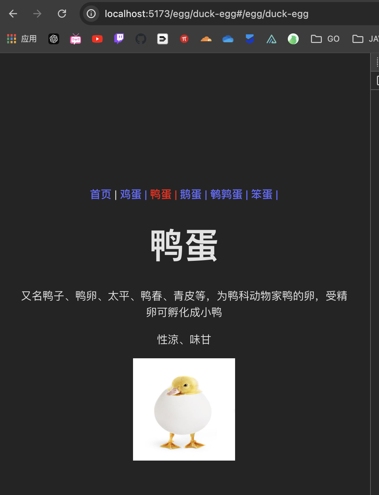

- `http://localhost:5173/egg/duck-egg` 是服务器路径。(Hash处理)
- `#/egg/goose-egg` 是客户端路由路径，由 `createWebHashHistory` 管理。

## 错误处理

### 处理错误路径路由

修改Eggs.vue

```vue
<script setup>
import { computed } from 'vue';
import { useRoute } from 'vue-router';
import dataEggs from '../data.json';

const route = useRoute();
const eggType = computed(() => route.params.eggType);
const dataEgg = computed(() => dataEggs.find(dataEgg => dataEgg.type === eggType.value));
</script>

<template>
  <div v-if="!dataEgg">
    <h1>查无此蛋</h1>
  </div>
  <div v-else>
    <h1>{{ dataEgg.name }}</h1>
    <p>{{ dataEgg.description }}</p>
    <p>{{ dataEgg.flavour }}</p>
    
  </div>
</template>

<style scoped>
img {
  width: 150px;
  height: 150px;
}
</style>
```

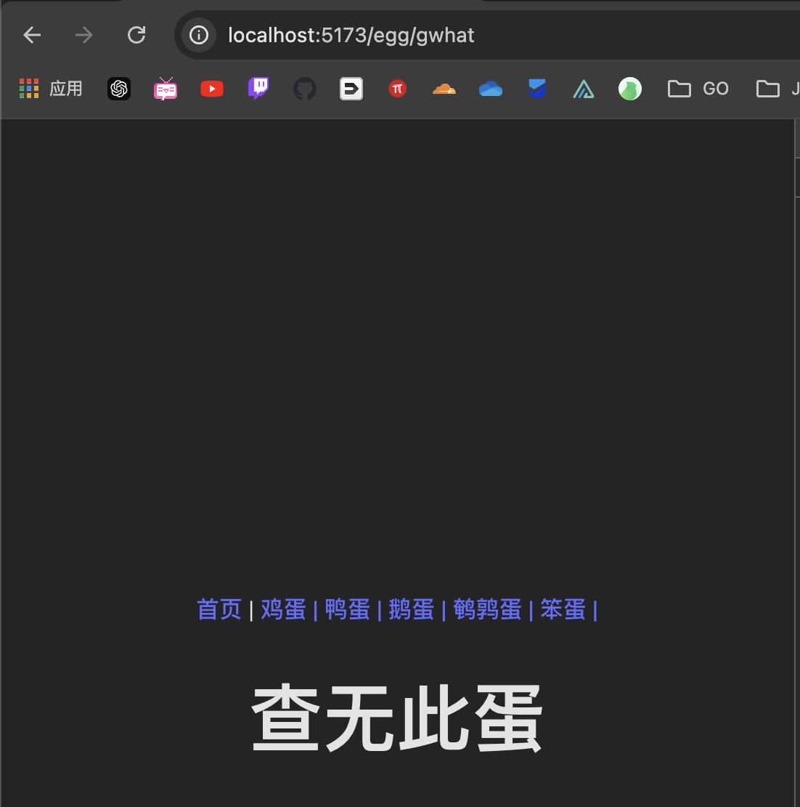

注意错误路由的发生，egg/错误路径，以为Eggs.vue这个错误路由的触发靠的就是/egg/eggType这条路由信息。

### 404NotFound

1. 创建NotFound页面
2. router的index.js导入组件之后创建路由信息

#### 核心语句

```vue
  { path: '/:pathMatch(.*)*', component: NotFound }
```

> 正则表达式匹配

## 打包

### 核心语句

```bash
npm run build
```

得到的dist文件如下：

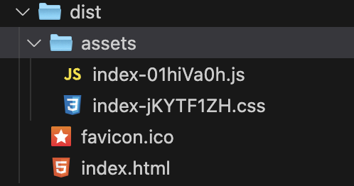

资源得到了全部的整合。

> 这个时候npm run dev 可见所有资源都被加载了，所以引入了下面的懒加载。

## 懒加载

> 在访问主页的时候所有资源都会加载好，如果想要用户在访问某个界面的时候在进行某个界面的时候再加载，这个时候就需要懒加载了。

修改router文件夹的index.js

### index.js

```js
import { createRouter, createWebHistory,createWebHashHistory } from 'vue-router'
import Home from '../views/Home.vue'
import NotFound from '@/views/NotFound.vue';

const routes = [
  { path: '/', component: Home },
  { path: '/egg/:eggType', component:()=> import('../views/Eggs.vue') },
  {path:'/egg',redirect:'/egg/chicken-egg'},
  { path: '/:pathMatch(.*)*', component:()=> import('../views/NotFound.vue') },
];

const router = createRouter(
  {
    history: createWebHistory(),
    routes,
    linkActiveClass: 'egg-active'
  }
)
export default router
```

### 重新打包

```bash
npm run build
```

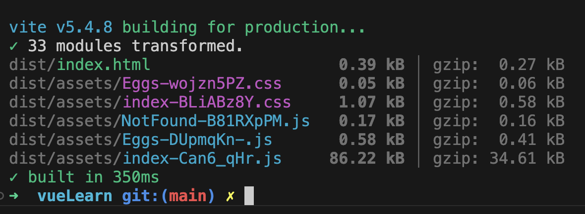

可见这次多了几个文件，在网页加载的时候懒加载：对应文件才会加载出来。

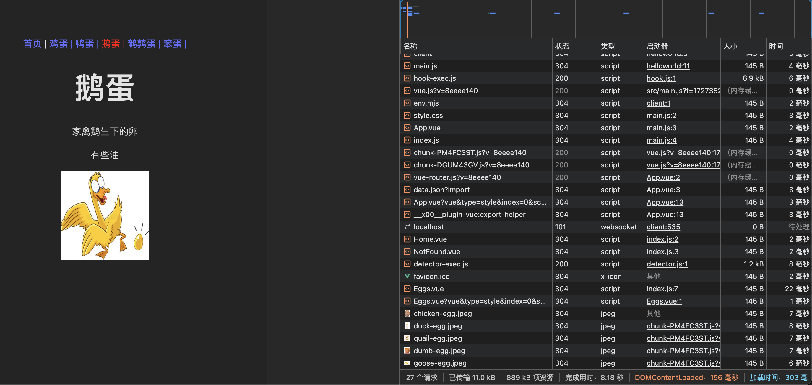

随着自己的点击：后面的jpeg文件/部分css文件/js文件陆陆续续加载出来。

## 路由命名

> 方便App.vue的书写

## 补充

### style.css

```css
:root {
  font-family: Inter, system-ui, Avenir, Helvetica, Arial, sans-serif;
  line-height: 1.5;
  font-weight: 400;

  color-scheme: light dark;
  color: rgba(255, 255, 255, 0.87);
  background-color: #242424;

  font-synthesis: none;
  text-rendering: optimizeLegibility;
  -webkit-font-smoothing: antialiased;
  -moz-osx-font-smoothing: grayscale;
  -webkit-text-size-adjust: 100%;
}

a {
  font-weight: 500;
  color: #646cff;
  text-decoration: inherit;
}
a:hover {
  color: #535bf2;
}

a {
  font-weight: 500;
  color: #646cff;
  text-decoration: inherit;
}
a:hover {
  color: #535bf2;
}

body {
  margin: 0;
  display: flex;
  place-items: center;
  min-width: 320px;
  min-height: 100vh;
}

h1 {
  font-size: 3.2em;
  line-height: 1.1;
}

button {
  border-radius: 8px;
  border: 1px solid transparent;
  padding: 0.6em 1.2em;
  font-size: 1em;
  font-weight: 500;
  font-family: inherit;
  background-color: #1a1a1a;
  cursor: pointer;
  transition: border-color 0.25s;
}
button:hover {
  border-color: #646cff;
}
button:focus,
button:focus-visible {
  outline: 4px auto -webkit-focus-ring-color;
}

.card {
  padding: 2em;
}

#app {
  max-width: 1280px;
  margin: 0 auto;
  padding: 2rem;
  text-align: center;
}

@media (prefers-color-scheme: light) {
  :root {
    color: #213547;
    background-color: #ffffff;
  }
  a:hover {
    color: #747bff;
  }
  button {
    background-color: #f9f9f9;
  }
}
```

### data.json

```json
[
  {
    "id": 1,
    "name": "鸡蛋",
    "type": "chicken-egg",
    "image": "chicken-egg.jpeg",
    "description": "又名鸡卵、鸡子，是母鸡所产的卵",
    "flavour": "味甘，性平，无毒（煮熟后）"
  },
  {
    "id": 2,
    "name": "鸭蛋",
    "type": "duck-egg",
    "image": "duck-egg.jpeg",
    "description": "又名鸭子、鸭卵、太平、鸭春、青皮等，为鸭科动物家鸭的卵，受精卵可孵化成小鸭",
    "flavour": "性涼、味甘"
  },
  {
    "id": 3,
    "name": "鹅蛋",
    "type": "goose-egg",
    "image": "goose-egg.jpeg",
    "description": "家禽鹅生下的卵",
    "flavour": "有些油"
  },
  {
    "id": 4,
    "name": "鹌鹑蛋",
    "type": "quail-egg",
    "image": "quail-egg.jpeg",
    "description": "鵪鶉所產的卵，蛋殼表面帶有棕褐色斑點",
    "flavour": "味甘、性平"
  },
  {
    "id": 5,
    "name": "笨蛋",
    "type": "dumb-egg",
    "image": "dumb-egg.jpeg",
    "description": "我才不是笨蛋",
    "flavour": "没吃过"
  }
]
```

### 箭头函数

```js
// 无参数的箭头函数
const noParam = () => console.log('No parameters');

// 一个参数的箭头函数
const oneParam = x => x * x;

// 多个参数的箭头函数
const multipleParams = (x, y) => x + y;

// 带有代码块的箭头函数
const withBlock = (x, y) => {
  const sum = x + y;
  return sum;
};
```

