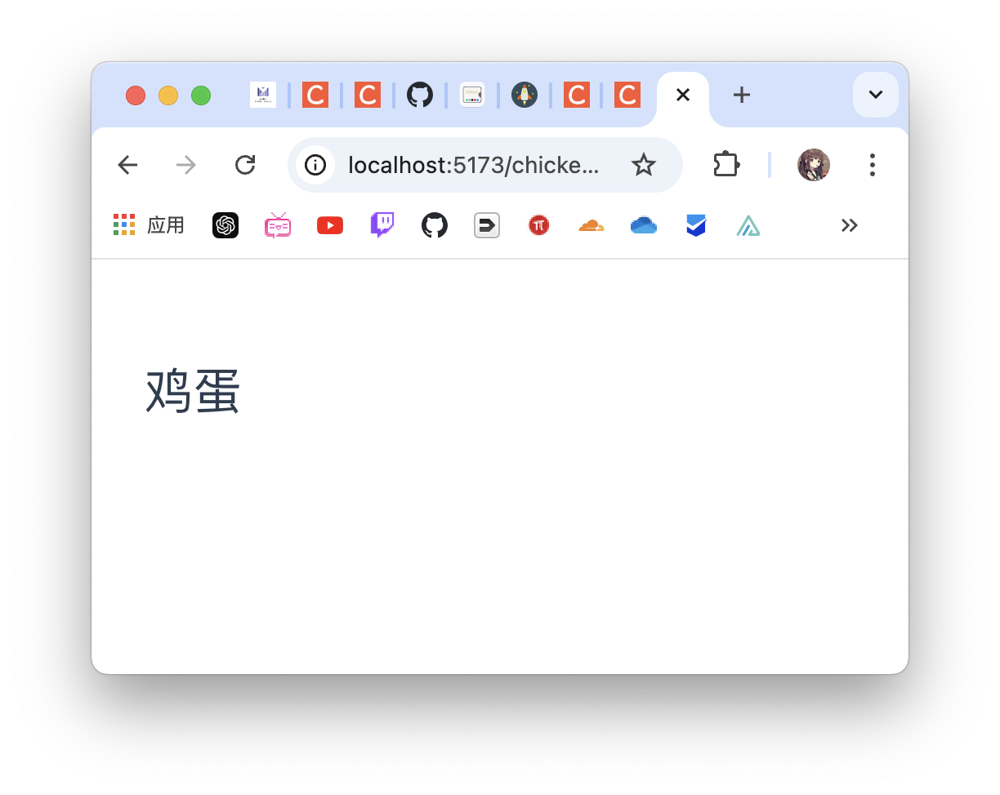

# vue_router
> vue的router学习练习

## 基本使用

1. 创建路由器
2. 应用到根组件上
3. 定义路由组件

### 创建路由器

> 在main.js中新建临时路由器（对象思维）

```js
import './assets/main.css'

import { createApp } from 'vue'
import App from './App.vue'
import { createMemoryHistory, createRouter, createWebHistory } from 'vue-router'
import Home from './views/Home.vue'
import ChickenEgg from './views/ChickenEgg.vue'

const router = createRouter(
  {
    history:createWebHistory(),
    routes: [
      { path: '/', component: Home },
      { path: '/chicken-egg', component: ChickenEgg },
    ]
    // 创建路由:注意创建路由还是不行，需要创建历史模式
  }
)


const app = createApp(App)

app.use(router)

app.mount('#app')
// ceateApp(App).use(router).mount('#app')
// 一键创建实例并且挂载
```

### 应用到根组件上

```vue
<script setup>
import { RouterLink, RouterView } from 'vue-router'
</script>

<template>
  <div>
    <RouterLink to="/"></RouterLink>
    <RouterLink to="/chicken-egg"></RouterLink>
    <!-- 里面能填些内容，表现就像nav标签一样了 -->
    <RouterView />
  </div>
</template>

```

### 定义路由组件

Home组件和ChickenEgg组件就不看了，随便填填能够实现路由逻辑了。	



简单展示下即可。

